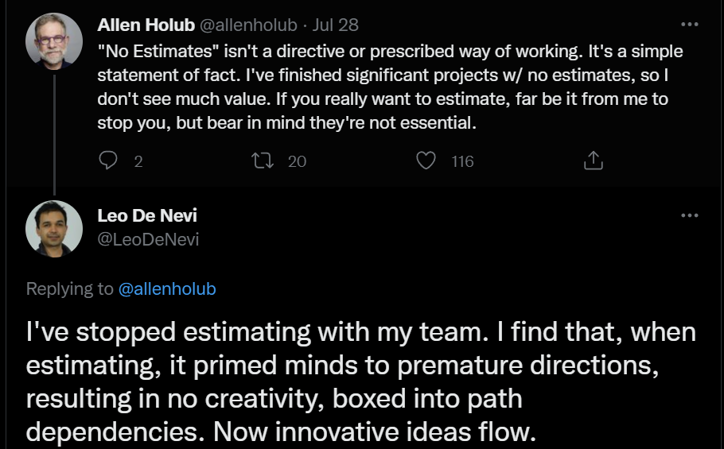

# Agile - ways of working

- [Intro](#intro)
- [What is Agile](#what-is-agile)
  - [Agile manifesto](#agile-manifesto)
  - [Principles behind the Agile Manifesto](#principles-behind-the-agile-manifesto)
  - [Words](#words)
  - [An expansion on the values and principles of the Agile Manifesto](#an-expansion-on-the-values-and-principles-of-the-agile-manifesto)
  - [The wrong questions about Agile](#the-wrong-questions-about-agile)
- [Agile methodologies](#agile-methodologies)
- [How to produce code using Agile?](#how-to-produce-code-using-agile)
  - [The Death of Agile](#the-death-of-agile)
  - [Gotta Be Good](#gotta-be-good)
- [Can we do Agile *right*?](#can-we-do-agile-right)
- [Governing Agile Delivery](#governing-agile-delivery)
- [What value do estimations provide?](#what-value-do-estimations-provide)
- [What should happen on a daily stand-up meeting?](#what-should-happen-on-a-daily-stand-up-meeting)
- [Scrum is not for humans](#scrum-is-not-for-humans)
- [Agility is not speed](#agility-is-not-speed)
- [How Big Tech Runs Tech Projects and the Curious Absence of Scrum](#how-big-tech-runs-tech-projects-and-the-curious-absence-of-scrum)

## Intro

This document is not meant to define what is good or bad in terms of Agile, but rather to expand awareness on Agile concepts and many preconceptions.

When it comes to Agile, apart from the Agile Manifesto & Principles, all the information gathered here is a reflection on the author's opinions and experiences. Not a dogma to follow. Read this with a critical mind.

This document paints a picture of Agile and is meant to be read and analyzed in its entirity, as opposed to picking and choosing parts. It consists of:

- 10 articles
- 4 videos totalling 165min

## What is Agile

The definition of Agile can be found in the [Agile Manifesto](https://agilemanifesto.org/) and [its Principles](https://agilemanifesto.org/principles.html).

### Agile manifesto

> We are uncovering better ways of developing software by doing it and helping others do it. Through this work we have come to value:
>
> - Individuals and interactions over processes and tools.
> - Working software over comprehensive documentation.
> - Customer collaboration over contract negotiation.
> - Responding to change over following a plan.
>
> **That is, while there is value in the items on the right, we value the items on the left more.**

### Principles behind the Agile Manifesto

<strong>Principles</strong>

 

- Our highest priority is to satisfy the customer through early and continuous delivery of valuable software.

- Welcome changing requirements, even late in development. Agile processes harness change for the customer's competitive advantage.

- Deliver working software frequently, from a couple of weeks to a couple of months, with a preference to the shorter timescale.

- Business people and developers must work together daily throughout the project.

- Build projects around motivated individuals. Give them the environment and support they need, and trust them to get the job done.

- The most efficient and effective method of conveying information to and within a development team is face-to-face conversation.

- Working software is the primary measure of progress.

- Agile processes promote sustainable development. The sponsors, developers, and users should be able to maintain a constant pace indefinitely.

- Continuous attention to technical excellence and good design enhances agility.

- Simplicity--the art of maximizing the amount of work not done--is essential.

- The best architectures, requirements, and designs emerge from self-organizing teams.

- At regular intervals, the team reflects on how to become more effective, then tunes and adjusts its behavior accordingly.

### [Words](https://holub.com/words/)

<strong>Words that DO NOT appear in the Agile Manifesto & Principles</strong>

 

- Sprint
- backlog
- product owner
- manager
- PBI (product backlog item)
- scrum master
- Sprint review
- QA team
- PMO
- release train
- product increment
- stand-up (or Daily Scrum)
- meeting
- story point
- estimate
- faster
- time
- velocity
- quarterly plan
- Jira
- productivity
- utilization
- certification
- standardized
- process (as a positive)
- methodology
- ceremony
- accountability
- responsibility
- hierarchy

<strong>Words that DO appear in the Agile Manifesto & Principles</strong>

 

- individuals
- interaction
- discovering
- valuable (software)
- collaboration
- change
- customer
- deliver…frequently
- conversation
- technical excellence

### An expansion on the values and principles of the Agile Manifesto

Sometimes people have a hard time understanding the ramifications of the Agile Manifesto because it's so terse so Allen Holub put together a list of [Heuristics for Effective ~~Software Development~~ Organizations](https://holub.com/heuristics/). This is entirily rooted on the values and principles of the Agile Manifesto but tries to be more clearer, more contemporary and more specific on certain things that must hold true in order for you to be able to execute said values and principles.

This list represents a snapshot of Allen's Holub thinking in a moment in time, not a set of irrefutable truths.

### The wrong questions about Agile

When learning about Agile it happens that sometimes people tend to try and fit it into their world view, their unconscious bias drives them that way. You must let go of past preconceived notions to truly understand Agile.

[See here a few examples.](https://holub.com/wrong-questions/)

## Agile methodologies

There are many Agile methodologies out there:

- XP
- Scrum
- Kanban
- Dynamic Systems Development Method (DSDM)
- Feature Driven Development (FDD)
- Crystal
- ...

The most common used in the software development industry are Scrum, Kanban or a variation/mix of these.

## How to produce code using Agile?

### The Death of Agile

The replacement of *real agility* with *fake agility*: [The Death of Agile (Allen Holub) - 36min video](https://www.youtube.com/watch?v=HZyRQ8Uhhmk).

<strong>Some bookmarks</strong>

 

- What is Agile? [from 24:32](https://youtu.be/HZyRQ8Uhhmk?t=1472) up to 27:03
- Are retrospective meetings required? [from 31:09 up to 31:43](https://youtube.com/clip/UgkxFl8x7iSYba1KDxm9E7K2-fZ2foB87Gxu)

### Gotta Be Good

[What it takes, in a team, to thrive in an environment where you are supposed to produce discernible software value every week.](https://ronjeffries.com/articles/-z022/0222ff/gotta-be-good/)

## Can we do Agile *right*?

> A few years ago, the death of agile was a meme. Agile was (and is still) being supplanted by #DarkAgile, agile in name only, with few of the benefits of the real thing. In a way, things have gotten worse. Agile has arisen as a zombie, eating the brains of the corporate world. "Dark Agile" flies in the face of basic principles and does active damage.
Allen Holub will pinpoint where we've gone wrong and how to make it right. There is a way out!

[War is Peace, Freedom is Slavery, Ignorance is Strength, Scrum is Agile • Allen Holub • GOTO 2020 - 45min video](https://www.youtube.com/watch?v=F42A3R28WMU)

## Governing Agile Delivery

> Agile development starts with small teams tackling small problems. After some initial successes the organisation gets more ambitious, and tries to get more teams tackling bigger problems. At some point these endeavours run headlong into finance and governance structures from a different era, designed with huge projects in mind, and it usually doesn’t end well.

[Governing Agile Delivery • Dan North • GOTO 2018 - 47min video](https://www.youtube.com/watch?v=wG-zBVl0A4g)

<strong>Some bookmarks</strong>

 

- What is documentation: [from 05:38 up to 6:30](https://youtube.com/clip/Ugkx5lUPeno9SM0fSrRpIeqo74mh-94iG9d-)
- Why planning software end to end is problematic (dynamic complexity): [from 12:52 up to 14:19](https://youtu.be/wG-zBVl0A4g?t=772)
- Funding is incremental: [from 16:00 up to 16:08](https://youtube.com/clip/UgkxttlO1s4gJ17wGSLWYxmyaVC6zZ__y8wF)
- Most organizations are here in their "Agile transformation": [from 19:37 up to 19:58](https://youtube.com/clip/UgkxuvpPukBZZAI4QgJYGpx0es52AU6ErGo8)
- What about program level delivery: [from 20:32 up to 21:30](https://youtube.com/clip/UgkxM6u8BvS3PCRNE-04Bp0NDIv1iDO1IHX-)
- Agile delivery and project cost/risk/return on investment: [from 24:41](https://youtu.be/wG-zBVl0A4g?t=1481) up to 30:10
- Why do we measure busyness rather than results? [from 33:45 up to 34:45](https://youtube.com/clip/UgkxwM0lX0mdm0FgUvQ3XXczy9XNOjeH5ubj)
- Why break down work into small batches? [from 37:02 up to 37:30](https://youtube.com/clip/Ugkx1U_gwKOdYGJjBTJUCOhV6iqESuhnVONm)
- Measuring stories vs measuring story points: [from 37:30  up to 38:45](https://youtu.be/wG-zBVl0A4g?t=2250)
- Governance in Agile -> [from 46:30 up to 47:25](https://youtube.com/clip/Ugkx9SDIRL0wb03ZhIkWiP56QTCsY6SaJ67k)

## What value do estimations provide?

[#NoEstimates (Allen Holub) - 37min video](https://www.youtube.com/watch?v=QVBlnCTu9Ms).
> This keynote presents my (and many other's) thinking about #NoEstimates. It argues that estimation is a bad thing, particularly in the Agile world, and presents ways to plan that don't involve estimation.

<strong>Some bookmarks</strong>

 

- What is a story point ? [from 09:06 up to 10:29](https://youtube.com/clip/UgkxoUVgskdtE5EboH-FPKcf4651ned65a98)
- One of the motivations for why we **think** we can't function without estimations: [from 15:24 up to 16:24](https://youtube.com/clip/UgkxqpquTT7mWPJ3Qmt5wbnBiEbB0f1SG9nn)
- Why building a large backlog is not useful: [from 16:28](https://youtu.be/QVBlnCTu9Ms?t=989) up to 18:00
- What is waste? [23:44 up to 24:28](https://youtube.com/clip/UgkxwAvfa1KTAILTmM80XPmsfDzlVaf88_EQ)
- If we don't estimate how do we run a business? We still need projections but estimations don't actually help: [from 24:30](https://youtu.be/QVBlnCTu9Ms?t=1470) up to 25:58
- Why estimating stories doesn't affect your projections: [from 26:25](https://youtu.be/QVBlnCTu9Ms?t=1585) up to 30:02
- How do you plan if there are no estimates? [from 31:24](https://youtu.be/QVBlnCTu9Ms?t=1884) up to 34:18

[No estimates by Vasco Duarte - 67min video](https://www.youtube.com/watch?v=cgvB2wWvi8M).
> Often we hear that estimating a project is a must. "We can't make decisions without them" we hear often. In this session I'll present examples of how we can predict a release date of a project without any estimates, only relying on easily available data.

## What should happen on a daily stand-up meeting?

Whether or not you are doing Scrum this meeting is usual a staple on Agile development methodologies. [Do we need it? Why? And if so what should happen on this meeting?](https://holub.com/nostandups/)

## Scrum is not for humans

[Not a single workday goes by without hearing people praising the virtues of Agile. For many, Agile became synonymous with Scrum. In this article, I argue that Scrum is very hostile to developers. More generally, I will explain why Scrum is not designed for humans.](https://maroun-baydoun.com/blog/scrum-is-not-for-humans/)

> Some teams can and will use Scrum. A prepackaged workflow could work under certain circumstances, but it achieves nothing in terms of agility. Agility is the antithesis of process and ceremonies. Agility is giving a development team trust to self-organise. Agility transcends all layers of an organisation. In fact, a truly agile organisation does away with most of its layers.
>
> Be careful anytime you buy into a methodology with inflated claims, rigid rules and unintuitive workflows. An ecosystem backed by certifications and “coaches” will create a feedback loop that perpetuates its shortcomings and hinders true progress.
>
> Any team can and should decide its own workflow. Processes are discovered, adopted and improved along the way. If you are a developer, make sure you are part of that conversation. By deferring those decisions to the “wise” men and women of the organisation, you give up the agency to determine your own fate. Any process in place should be there to serve you and not the other way around.

## Agility is not speed

[Although we may find ourselves nodding along to or advocating the mantra of “deliver better software, faster”, we should pause a moment to realise that what we probably mean is “deliver better software, sooner”. The difference is both subtle and huge.](https://kevlinhenney.medium.com/agility-speed-96057078fe40)

## How Big Tech Runs Tech Projects and the Curious Absence of Scrum

> A survey of how tech projects run across the industry highlights Scrum being absent from Big Tech.
>
> Project management is a topic most people have strong opinions on, and I’m no exception. To answer this question, I pulled in help from across the industry as well. In this issue we’ll cover:
>
> - Project management approaches across the industry. An overview of a survey with over 100 companies represented, plus key takeaways.
>
> - Project management at Big Tech. How are these done? How does the organizational setup of Big Tech influence how projects are executed?
>
> - The lack of Scrum at Big Tech. Why is the popular framework missing from most of Big Tech, and are there takeaways for companies operating outside this model?
>
> - How should you run projects in your team? I’ll share my personal take.

[Read more](https://newsletter.pragmaticengineer.com/p/project-management-in-tech)
