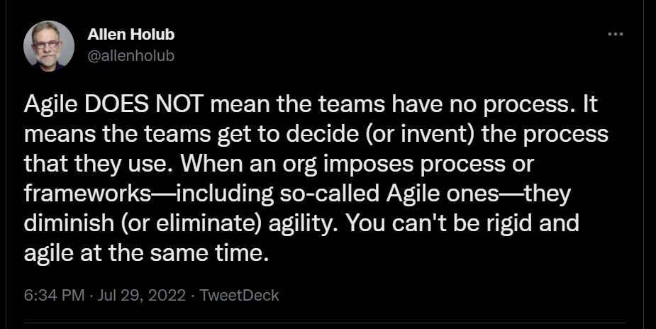

when creating a story instead of estimating story points/size whatever, we should ask: can we make it smaller?
- stories vs tasks?
- acceptance criteria? can we get it on our stories? should be small amount not a book, a large amount of acceptance criteris would mean we could prob split the story
- don't overplan stories, if we already have enough then we skip refinement
- define capacity? do we need?
- Project management artifacts and processes vary between teams even in the same organization. Most teams have a project backlog,**do standups at intervals as the team sees fit**, and retrospectives every now and then.
- board columms: Notes/Todo/Doing/Done
- who should/is required attend the daily stand-up? Why?
- we work mainly in a remote way and for us gather helps with continued collaboration

https://newsletter.pragmaticengineer.com/p/project-management-in-tech
- Autonomy for software engineers and teams. The expectation of developers at traditional companies is to complete assigned work. At SV-like companies, it's to solve problems that the business has. This is a huge difference. It impacts the day-to-day life of any engineer.
- Curious problem solvers, not mindless resources. A motivated engineer easily makes multiple times the impact of a "factory worker" who only does what they’re told.  For organizations with a factory worker attitude, this approach will bias towards more heavyweight project management approaches that leave little room for interpretation, on purpose.
- The process felt unnatural and like it had been forced on a fast-moving web team. We soon moved to a more fluid way of working, taking the Kanban approach. We stopped caring about sprints, and dropped most rituals that come with Scrum. We just cared about knowing what we’re working on now, and what it was we’d get done next.
- We shipped our code behind feature flags, and validated them with staged rollouts, starting with a rollout to the team. A lot of the “specs” – or tickets – were also written by engineers, who could then validate if they worked as expected. CI/CD, feature flags and experimentation tooling allowed us to have faster feedback cycles than relying on a Product Owner.
- Competent, autonomous people need less structure to produce reliable, high-quality output. Big Tech is able to attract, afford and hire these people.
Leveraging competent teams comes through giving them freedom to choose how to operate. This is true for most types of engineering, and there’s good reason why the Skunk Works model of autonomy with reduced bureaucracy, is what many high-performing teams with high-caliber people end up following.
- Slack time for innovation and unexpected work. For teams that are expected to innovate, how do you create slack time to make this happen? (MENTION THIS IN THE CONTEXT OF THE TIME TO LEARN/TEAM DEMOS part of team process) ELEMENTS CAN WORK ALONE OR TOGETHER ON AN IDEA

https://holub.com/heuristics/
- Process exists in service of people; the people come first. Processes not developed by the people who use them rarely work well, if at all.

https://holub.com/nostandups/
To me, a stand-up—if it makes any sense to have one at all—has four main benefits:

- To help with team unity by having a regular ritualized meeting.
- To avoid duplicate work.
- To give everybody a feeling about “where we are.” (i.e synchronization).
- To arrange to get help if you need it.

technical excellence - from agile manifesto
- the team should always strive towards it, how it affects the delivery of small chuncks should be considered into this but it doesn't mean that because we have to deliver iteratively that we ignore tech excellence

[An Engineering Team where Everyone is a Leader](https://blog.pragmaticengineer.com/a-team-where-everyone-is-a-leader/)
- quote from agile principle/manifesto to correlate with ppl's tech excellence and motivation, no need to wait for 1 person, everyone should be empowered,

contains historical explanations, understanding where things originated is important.
this is not meant to say what is good or bad but to expand your awareness on many Agile concepts and many preconceptions
Some things aren't dev centered, things you can change, some things are for product, or C level people, but worth knowing/understanding as part of a whole.
when I call out specific points it's for relevance, please watch the video in its entirity.
not a dogma, think about what is said, note on remote working, etc
do not watch just one, do not skip parts, the entire of videos/blogs paint a picture (add a preface to the readme that says this)
if you feel tired from watching a video or reading an article don't skip it, take a break and come back to it later
many notions/points end up repeated across the articles but in a good way, different perspectives,

do a count of the videos (sum the time) and the articles/links
add duration of videos near the links
after a video/article if you have questions or want to discuss it let's get together

# What is the team defined Agile process ?

If the teams are self organizing...

# FEEDBACK from team

standup
- who to ask about a piece of work (semi frequent)
- what ppl are working, point of coordination to ask ppl stuff
- know how the sprint is progressing
- hear what ppl are talking to perhaps re-align
- perhaps talk too much at standup

===problems
what about announcements? annual leave, absences, announcements from Shemira
force us to be more pragmatic in engaging with each other
peer pressure to complete work
some times ppl don't know they need help, ppl proactively reach out on standup

======================================

retros
lately not usefull
most raised issues are not resolve (gotta live with it)
ppl like to vent though
collectily pressure on Max
stop retros forever
should address the issues as we identify them
retros becoming quieter and quieter (perhaps related with frequency)
decrease in quality of issues being raised (tired of putting same issues every time)
perhaps longer cadency
dont find useful being pestered about story points not completed the sprint
like retros but find them disapointing them lately due to lack of actions
dont take enough actions

===problems

no downside
lack of platform for raising issues, would ppl not feel confortable raising them outside of a retro? => sln would be more proactive coordination
problems for introvers, talking with others

======================================

refinement

useful/valuable
opportunity to discuss how to approach the work as a team
understand the context for work
documenting how the team agreed to attempt to solve a piece of work
aware of what direction we are going
believe we have improved on this, more clarity on stories created

====problems

lack of opportunity for the team to understand what it needs to be achieved, how to achiev
miss opportunity to improve on future work based on past learnings
we woudl lack the awareness of what's the next direction

=====================================

planning

if we mantain sprints/iteration then it's useful , help to understand capacity
helps keep focus on goal, would be "laid back" on the work
useful to set objective
need to do this story quickly because we still have X stories to do
feel less pressure because we didn't set a commitment
feel more pressure because we have a log of stories to work through

=====
problems

only because there is a timebox
Provides a time for Shemira to steer priorities
if we got rid of planning of planning and stand ups we would lose the ability to coordinate, we aren't proactive enough

=============================================================

estimations
=> as a junior I use it as an indicator of complexity (can I tackle this alone?) a 1pt vs an 18pt
=? good to know if story is big or small
=> doesn't make any difference for the dev
=> only so that management can measure team performance
=> only because of the reporting (a way to have common reporting for all teams)
=> would it not enable knowing when things are done
=> abolish story points, keep S,M,L estimation
=> sometimes it's better to pick a smaller story because of cognitive load/end of day/ feeling

=============================================

kanban, build backlog, prioritise, pull from top
- avoids the non sense of stories too big to start, let's not start it
- find timebox sprint too restrictive, more process
- getting worked up about overcommiting, not completing this
- forces us to the velocity points per week
- we worked kanban before and it was fine
- mental pressure to get things done, ppl could be more relaxed and perform better

we would keep refinement
one of the reasons we went back to scrum was because there wasn't a formal "this is what we done and demo"
- we don't need to do it timeboxed, we would have regular demos

-> demos are good
  -> better as a scheduled meeting
  -> good to have everyone to hear feedback. The team gets more awareness of what is done
  -> not about sign off , an opportunity for the team to discuss what has been done
  -> could we review how we are doing the demos (cumbersome to prepare, the way we are doing at the moment)
  -> tag stories with demoable, perhaps add info to story about how to demo
  -> lack of defined process for the demo (like make sure we have things loaded up and ready to demo if they need to hack ui for instance, only demo stuff that is user facing etc)
  	-> lack of proper demo preparation, like running through what we need to show
	->
ad hoc improvment

united message about way of work or else ppl get confused
- some say don't care about story points
- other say, we need to care because we measure perf through them

pair programming/pair switching/mob programming?
- dont like the prescriptive way of working, too much of pair programming or too much of solo programing could be problematic
- love pairing with certain ppl, not so much with others
- like pairing, learn a lot when pairing with senior
- some stories don't make sense to pair on
- was fine working on my own, just went to ask others when had doubts
- some days prefer to solo music, others to be with other ppl

sprint
-> better mental structure

no need for sprints

# FEEDBACK from non team members

from product it doesnt matter as long as I get features out
=> if we increased the delivery rate it might be a problem
=> all for changing if it helps the team (if it doesn't adversivily affect the team)
=> all about delivery and making team happy , not overburden
=> projection of when we are able to deliver stuff
=? wants a demo

from ADM
=> metrics can't affect how the team works

Mo
=> scrum helps planning better for what gets delivered

================================================= NOT SURE WHAT THE BELOW IS

develop/test demo deploy
- no demo, deploy toggled off, Shemira tells when to toggle on
- 20% for stories that are for tech deb/improv (how do I know what 20% is? past history, every x amount of stories Y will be for improvements or every week we do X stories to .2X are stories for improv)
- merge PRs if not reviewed within 1h/2h (do we need review?)
- improve each other, seek pairs/mentors

when writing a story:
- estimation doesn't matter
- question instead: can I make this smaller

